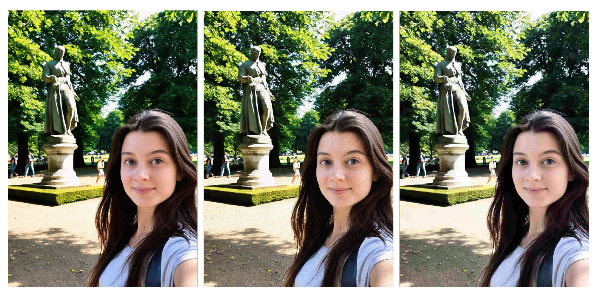

# 📸 Amateur Filter - Amateur Look for Stable Diffusion

sd-amateur-filter is a Stable Diffusion Automatic1111/WebUI extension that applies a realistic amateur effect to generated images. It mimics the imperfections of amateur photography by adding grain, noise, sharpening, desaturation, and adjustable JPEG compression.

## ✨ Features
- Post-processing filter that applies after image generation, keeping metadata intact.
- Basic & Advanced settings with collapsible panels for easy customization.
- Presets system to save, load, and manage your custom filter settings.
- Adjustable sliders for grain, sharpening, warmth, contrast, desaturation, and more.
- Phone-style JPEG compression simulation for an authentic "low-quality" aesthetic.

## 📥 Installation

### Automatic Installation (Recommended)

- Open Stable Diffusion WebUI
- Go to "Extensions" → "Install from URL"
- In the URL field, enter:

```bash
  https://github.com/ZyloO-ai/sd-amateur-filter.git
```
- Click "Install"
- Go to "Installed"
- Click "Apply and restart UI"

### Manual Installation

- Navigate to your Stable Diffusion Web UI directory:
```bash
  cd stable-diffusion-webui/extensions
```
- Clone this repository into the extensions folder:
```bash
  https://github.com/ZyloO-ai/sd-amateur-filter.git
```
- Restart the Stable Diffusion Web UI

You should now see an "Amateur Filter" collapsible panel in txt2img and img2img tabs.


## 🔧 Usage Guide
### 🟢 Basic Usage
- Enable the filter by checking the "Enable" box in the panel.
- Adjust the sliders under the "Basic" settings panel:
  - Sharpen Intensity: Makes details crisper.
  - Desaturation Factor: Controls how washed-out colors appear.
  - Grain Amount: Adds realistic digital noise.
  - JPEG Quality: Lower values increase compression artifacts.
- For more control, expand the "Advanced" panel to fine-tune color shifts, contrast, noise, and warmth.
- Click Generate, your image will be processed with the selected filter settings.


